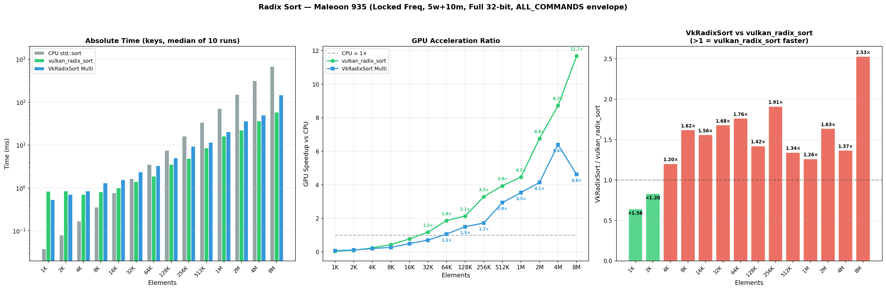
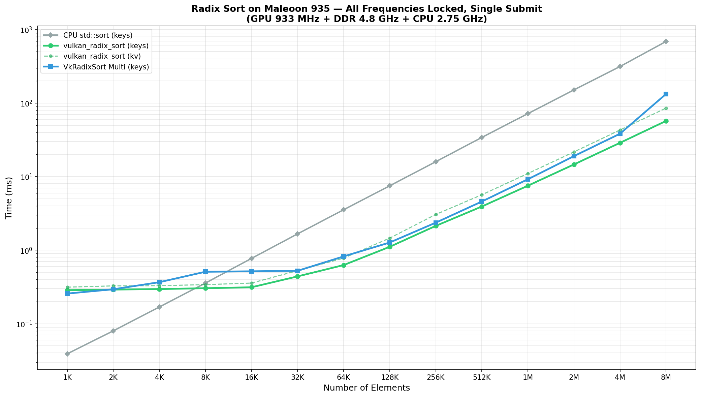

# Radix Sort Benchmark Results — Maleoon 935

Date: 2026-06-10

## Test Environment

| Item | Value |
|------|-------|
| **Device** | HarmonyOS arm64 phone |
| **GPU** | Maleoon 935, Vulkan 1.4.309, subgroupSize=32 |
| **CPU** | Kirin big.LITTLE: 4×1.72 GHz + 8×2.27 GHz + 2×2.75 GHz |
| **CPU sort** | `std::sort` / `std::stable_sort`, pinned to big cores (cpu12-13, 2.75 GHz) |
| **Frequency** | All 14 CPU cores locked to max via `scaling_min_freq = scaling_max_freq` |
| **GPU timing** | `vkCmdWriteTimestamp` (ALL_COMMANDS_BIT) × `timestampPeriod` (~107 ns/tick), envelope |
| **CPU timing** | `std::chrono::high_resolution_clock` for `std::sort` |
| **Build** | HarmonyOS NDK cross-compiled, `-DCMAKE_BUILD_TYPE=Release` |
| **Sizes** | 1K, 2K, 4K, 8K, 16K, 32K, 64K, 128K, 256K, 512K, 1M, 2M, 4M, 8M |

## Algorithms Compared

| Algorithm | Source | Dispatch/Pass | Pipeline | Warmup | Runs |
|-----------|--------|---------------|----------|--------|------|
| **CPU std::sort** | C++ STL | — | — | 5 | 10 (median) |
| **vulkan_radix_sort** | [vulkan_radix_sort](.) | 3 dispatch/pass (upsweep→spine→downsweep) × 4 passes | Created once | 5 | 10 (median) |
| **VkRadixSort Multi** | [VkRadixSort](../VkRadixSort) | 2 dispatch/pass (histogram→scatter) × 4 passes | Created once (reused) | 5 | 10 (median) |

Both GPU radix sorts operate on 32-bit unsigned integers (full range `[0, 2³²-1]`) with 4 × 8-bit radix passes and `WORKGROUP_SIZE=256`.

## Timing Methodology

Both GPU implementations use `vkCmdWriteTimestamp` with `VK_PIPELINE_STAGE_ALL_COMMANDS_BIT` to measure the **envelope** time from first to last timestamp:

- **vulkan_radix_sort**: 2 timestamps (start/end) around the entire sort command buffer → single envelope
- **VkRadixSort Multi**: 8 timestamps (2 per iteration × 4 iterations) → envelope from first to last timestamp

This captures the full GPU pipeline including barriers, fill buffer, and inter-dispatch synchronization, making the measurements directly comparable.

## Full Comparison (Locked Max Freq, Fair Settings)

### Keys-only Sort (GPU timestamp envelope, median of 10 runs)

| N | CPU (ms) | vulkan_radix_sort (ms) | VkRadixSort Multi (ms) | vrs/CPU | vkr/CPU | vkr/vrs |
|---:|---:|---:|---:|---:|---:|---:|
| 1K | 0.038 | 0.834 | 0.534 | 0.05× | 0.07× | 0.64× |
| 2K | 0.080 | 0.851 | 0.707 | 0.09× | 0.11× | 0.83× |
| 4K | 0.169 | 0.704 | 0.846 | 0.24× | 0.20× | 1.20× |
| 8K | 0.356 | 0.815 | 1.319 | 0.44× | 0.27× | 1.62× |
| 16K | 0.766 | 0.993 | 1.548 | 0.77× | 0.49× | 1.56× |
| **32K** | **1.658** | **1.406** | **2.360** | **1.18×** | 0.70× | 1.68× |
| 64K | 3.526 | 1.883 | 3.319 | 1.87× | **1.06×** | 1.76× |
| 128K | 7.559 | 3.538 | 5.028 | 2.14× | 1.50× | 1.42× |
| 256K | 16.066 | 4.882 | 9.327 | 3.29× | 1.72× | 1.91× |
| 512K | 33.917 | 8.602 | 11.535 | 3.94× | 2.94× | 1.34× |
| **1M** | **71.822** | **16.100** | **20.316** | **4.46×** | **3.54×** | 1.26× |
| **2M** | **150.248** | **22.209** | **36.305** | **6.77×** | **4.14×** | 1.63× |
| **4M** | **317.559** | **36.393** | **49.703** | **8.73×** | **6.39×** | 1.37× |
| **8M** | **680.439** | **58.250** | **147.243** | **11.68×** | **4.62×** | **2.53×** |

> **vrs/CPU** = CPU time / vulkan_radix_sort time (>1 = GPU faster)
> **vkr/CPU** = CPU time / VkRadixSort time (>1 = GPU faster)
> **vkr/vrs** = VkRadixSort time / vulkan_radix_sort time (>1 = vulkan_radix_sort faster, <1 = VkRadixSort faster)

### Key-Value Sort (vulkan_radix_sort only)

| N | CPU kv (ms) | vrs kv GPU (ms) | GPU Speedup |
|---:|---:|---:|---:|
| 1K | 0.055 | 0.896 | 0.06× |
| 2K | 0.121 | 0.834 | 0.15× |
| 4K | 0.219 | 0.871 | 0.25× |
| 8K | 0.514 | 0.937 | 0.55× |
| 16K | 1.033 | 1.066 | 0.97× |
| **32K** | **2.391** | **1.679** | **1.42×** |
| 64K | 4.818 | 2.786 | 1.73× |
| 128K | 11.105 | 3.695 | 3.01× |
| 256K | 22.216 | 6.303 | 3.52× |
| 512K | 50.576 | 10.906 | 4.64× |
| **1M** | **103.483** | **18.532** | **5.58×** |
| **2M** | **246.079** | **27.366** | **8.99×** |
| **4M** | **520.134** | **43.290** | **12.02×** |
| **8M** | **1237.917** | **83.894** | **14.76×** |

### Scaling Curves

## Key Findings

### 1. Crossover Points

| Algorithm | Crossover N | Speedup at Crossover |
|-----------|:-----------:|:--------------------:|
| vulkan_radix_sort | **32K** | 1.18× |
| VkRadixSort Multi | **64K** | 1.06× |

At N < 32K, CPU `std::sort` is faster due to GPU launch overhead (~0.7 ms latency floor).

### 2. vulkan_radix_sort vs VkRadixSort Multi

| Size Range | vkr/vrs | Winner | Margin |
|------------|:-------:|--------|--------|
| 1K | 0.64× | **VkRadixSort** | 36% |
| 2K | 0.83× | VkRadixSort | 17% |
| 4K | 1.20× | vulkan_radix_sort | 20% |
| 8K–16K | 1.56–1.62× | vulkan_radix_sort | 56–62% |
| 32K–64K | 1.68–1.76× | vulkan_radix_sort | 68–76% |
| 128K–512K | 1.34–1.91× | vulkan_radix_sort | 34–91% |
| 1M | 1.26× | vulkan_radix_sort | 26% |
| 2M | 1.63× | vulkan_radix_sort | 63% |
| 4M | 1.37× | vulkan_radix_sort | 37% |
| **8M** | **2.53×** | **vulkan_radix_sort** | **153%** |

**VkRadixSort wins at N ≤ 2K** where its lower dispatch count (2 vs 3 per pass) gives it a latency advantage. At N ≥ 4K, vulkan_radix_sort wins consistently. The gap widens dramatically at N=8M where VkRadixSort suffers memory pressure (2.96× growth for 2× data from 4M→8M).

### 3. Peak Performance (N=8M, Locked)

| Sort | GPU (ms) | CPU (ms) | GPU Speedup | Throughput |
|------|--------:|--------:|------------:|-----------:|
| **vulkan_radix_sort keys** | 58.25 | 680.44 | **11.68×** | **144 MItems/s** |
| **vulkan_radix_sort kv** | 83.89 | 1237.92 | **14.76×** | 100 MItems/s |
| VkRadixSort Multi keys | 147.24 | 680.44 | 4.62× | 57 MItems/s |
| CPU std::sort | — | 680.44 | 1.00× | 12 MItems/s |

### 4. Scaling Analysis

How time grows when data doubles (ideal = 2.00×):

| Transition | CPU | vulkan_radix_sort | VkRadixSort |
|:----------:|:---:|:-----------------:|:-----------:|
| 1M → 2M | 2.09× | **1.38×** | 1.79× |
| 2M → 4M | 2.11× | **1.64×** | 1.37× |
| 4M → 8M | 2.14× | **1.60×** | **2.96×** ⚠️ |

**vulkan_radix_sort scales sub-linearly** at large N — its throughput keeps climbing (65 → 94 → 115 → 144 MItems/s) as the GPU becomes more utilized. At N=8M it reaches **144 MItems/s**, 2.5× its throughput at 1M.

**VkRadixSort degrades at 4M→8M**: time grows 2.96× for 2× data, and throughput drops from 84 to 57 MItems/s. This is likely caused by memory pressure — at 8M, the keys buffer (32 MB) + ping-pong buffer + histograms approach or exceed available GPU memory, and VkRadixSort's scatter-based random write pattern suffers high cache/TLB miss rates.

### 5. CPU Scaling

CPU `std::sort` at locked 2.75 GHz follows O(N log N) exactly. The normalized time T/(N·log₂N) converges to **~3.4 ns** for N ≥ 16K, which is ~9.4 clock cycles per comparison-swap on the Cortex core.

### 6. Why the Gap Widens at Large N

The two implementations use fundamentally different scatter strategies:

| Aspect | vulkan_radix_sort (downsweep) | VkRadixSort (scatter) |
|--------|-------------------------------|----------------------|
| Atomics | `subgroupBallot` for wave-internal ranking; 1 `atomicAdd` per radix bin only when `waveOffset==0` | `atomicAdd(histogram[bin], 1U)` in shared memory per element |
| Scatter reads | Direct partition-based output | 8×256 shared memory reads per element via `bin_flags` |
| Prefix sum | Single global histogram per pass | Per-workgroup histograms → prefix sum over ALL workgroups |
| Memory pattern | Better locality (partition-based) | Random write scatter |

At small N, VkRadixSort's lower dispatch count (8 vs 12 total) gives it an edge. At large N, vulkan_radix_sort's more efficient atomics and better memory locality dominate.

## Fair Comparison Methodology

All measurements use identical methodology:

1. **Same warmup**: 5 warmup runs before timing (both implementations)
2. **Same repeat count**: Median of 10 timed runs (both implementations)
3. **Same data range**: Full 32-bit `[0, 2³²-1]` uniform random integers (both implementations)
4. **Same timestamp stage**: `VK_PIPELINE_STAGE_ALL_COMMANDS_BIT` for all timestamps
5. **Same measurement type**: GPU timestamp envelope (first→last timestamp), not per-pass sum
6. **Same pipeline policy**: Vulkan pipeline created once, reused across all sizes
7. **Same frequency**: All 14 CPU cores locked to max frequency
8. **Correctness verified**: Each run verified against CPU `std::sort` result

### Remaining inherent differences

| Aspect | vulkan_radix_sort | VkRadixSort Multi |
|--------|-------------------|-------------------|
| Submit pattern | Single command buffer per sort | 4 command buffers, semaphore-chained |
| Dispatch count | 12 (3 × 4 passes) | 8 (2 × 4 passes) |
| Pipeline barriers | Between upsweep/spine/downsweep | Between histogram/scatter |
| Timestamp count | 2 (single envelope) | 8 (envelope from first to last) |

These are inherent to each algorithm's design and represent real-world performance characteristics.

## Device Info

- **SoC**: Kirin (ARM big.LITTLE, 14 cores)
- **CPU topology**: 4×1.72 GHz (LITTLE) + 8×2.27 GHz (mid) + 2×2.75 GHz (big)
- **GPU**: Maleoon 935, Vulkan 1.4.309
- **subgroupSize**: 32, maxComputeInvocations=1024, maxSharedMemory=32768
- **timestampPeriod**: ~107 ns/tick

## Raw Data

- `vulkan_perf_locked.csv` — vulkan_radix_sort GPU, locked max freq (1K–1M)
- `cpu_perf_locked.csv` — CPU std::sort, locked max freq (1K–1M)
- `benchmark_comparison_full.png` — 3-panel comparison chart (1K–8M)
- `benchmark_comparison_scaling.png` — log-log scaling curves (1K–8M)
